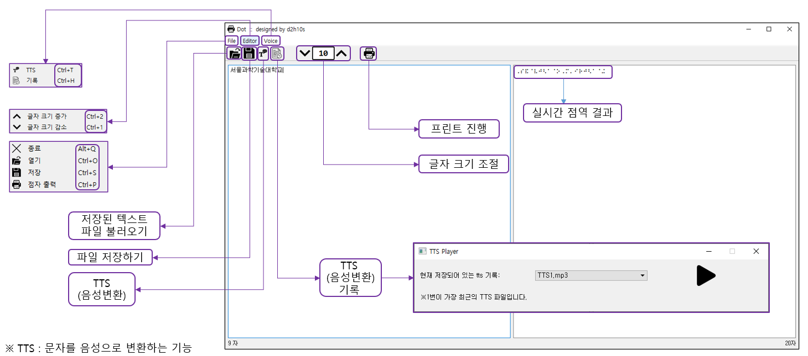
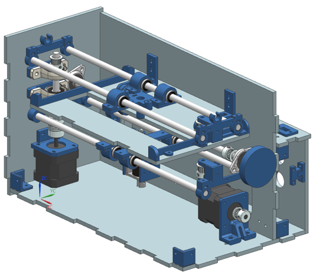
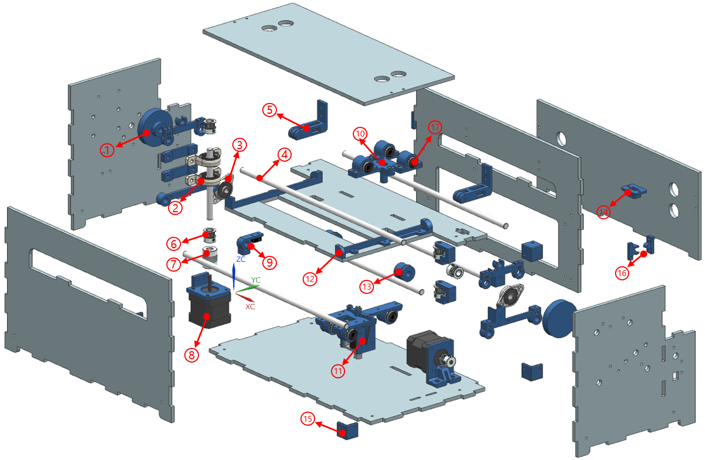
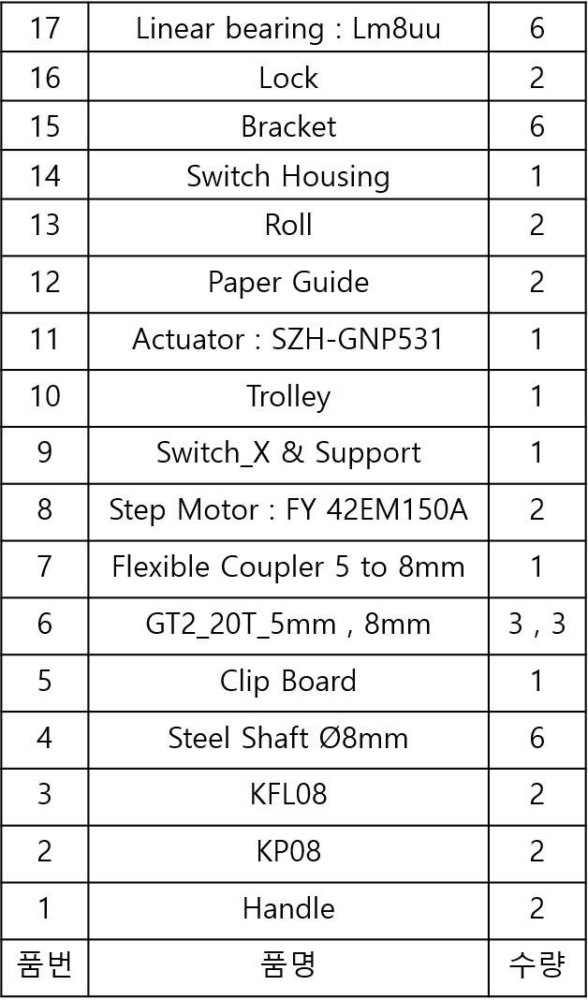
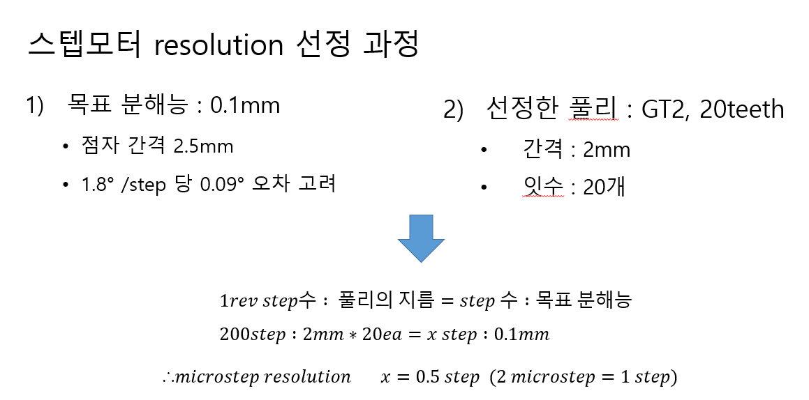
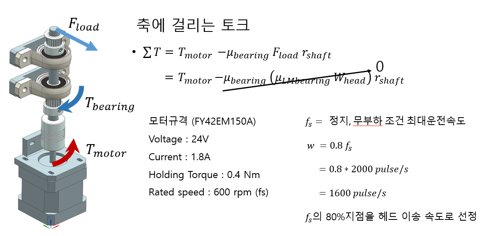
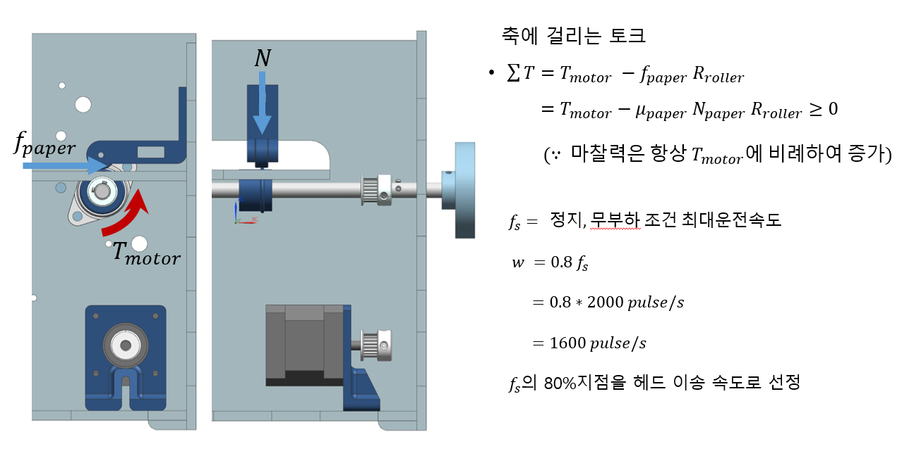
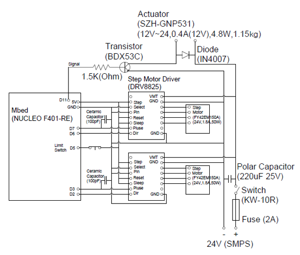

# Braille Printer PC SW
## Brief
이 프로그램은 자체 제작한 점자 프린터의 HW를 지원하는 PC SW입니다. 
텍스트 편집, 자동 한글->점자 변환기, TTS, OCR 기능이 포함되어 있습니다. 
 
점자 프린터는 ARM Cortex-M4 프로세서가 사용 되었으며, SW는 mbed-os 2.0을 기반으로 제작되었습니다. 

## SW Manual

이 매뉴얼의 버전은 1.3로 최신 매뉴얼은 1.4입니다. 
차후 업데이터 예정입니다.
<!--
## Shape

     
    Isometric

## Parts
### View

    
    

### Step Motor Resolution

### Calculating Step Motor Speed
#### 

## Schematic

    

-->